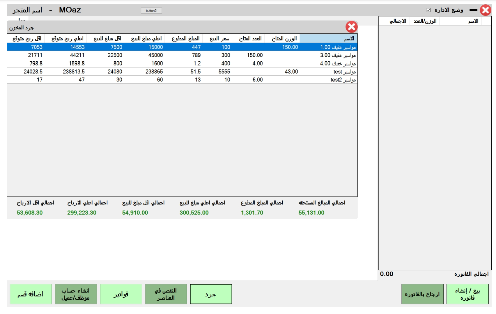

# Store Management System

## Introduction

The Store Management System is a desktop application developed to address the challenges faced by store owners in managing inventory and sales. This project was initiated to assist my dad, who owns a store with a wide range of products and frequently changing prices. The system provides an intuitive interface for easy manipulation and navigation of products, allowing efficient inventory management and sales tracking.

### Author

- [Moaz Ahmed Sayed's LinkedIn](https://eg.linkedin.com/in/moaz-ahmed-a4529325a)

### Inspiration

Growing up, I witnessed my dad's relentless dedication to his store, yet I also saw the challenges he faced in keeping track of inventory and navigating fluctuating prices. His determination inspired me to leverage my technical skills to develop a tool that would streamline these processes and enhance his business operations.

### Technical Challenge

The most significant technical challenge I encountered was designing a flexible system capable of handling diverse selling methods, such as selling by kilo and by quantity. I delved deep into algorithms and data structures to devise a solution that could accurately track inventory levels and accommodate varying unit measurements.

## Features

- **Intuitive Interface:** Designed with simplicity and usability in mind, the user interface provides easy navigation and seamless interaction.
- **Dynamic Inventory Management:** Utilizing custom algorithms, the system efficiently manages inventory updates, price changes, and product additions.

## Timeline and Struggles

The journey to develop the Store Management System was not without its challenges. Balancing my academic responsibilities with project development posed significant time constraints, leading to late nights and early mornings dedicated to coding and debugging. However, each obstacle served as a learning opportunity, reinforcing my resilience and commitment to the project's success.

## Next Iteration

Looking ahead, I envision further enhancing the Store Management System with additional features such as:
- Integration with online sales platforms for seamless multichannel inventory management.
- Implementation of predictive analytics to forecast demand and optimize stock levels.
- Enhanced user customization options for tailored reporting and data visualization.

## Installation

To install and run the Store Management System, follow these steps:

1. Download the installer from [link_to_installer](https://github.com/MoazAhmedS/Store/releases/tag/v0.1-beta).

2. Run the installer and follow the installation instructions.

## Usage

The Store Management System simplifies inventory management and sales tracking. Users can easily add, edit, and remove products, update prices and quantities, and generate reports to analyze sales data. The intuitive interface makes it user-friendly for store owners and employees to navigate and utilize the system effectively.

## Contributing

Contributions to the Store Management System are not available yet.

## Related Projects

I don't have any related project, Because this is my first project.

## Licensing

This project for now don't have license.

## Screenshot

## Resources

I didn't use any resources for my project.
